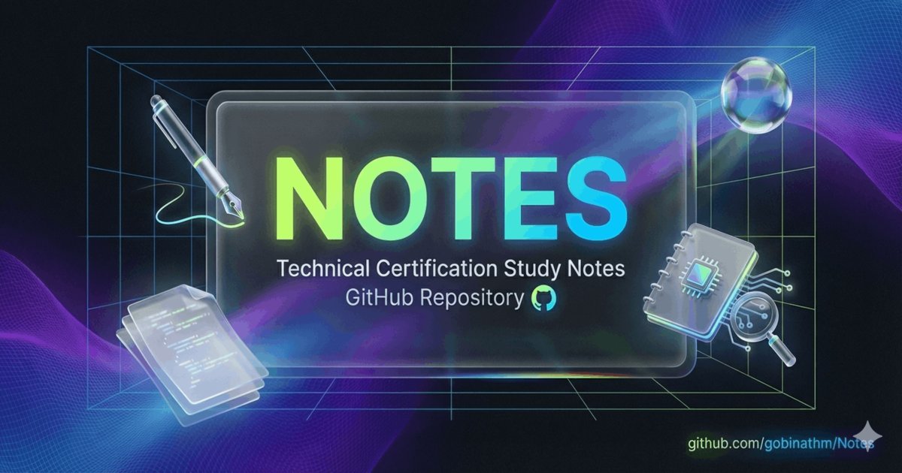

# Tech Certification Study Notes

> Your journey to certification success 🚀



[](https://github.com/gobinathm/Notes/blob/main/LICENSE)
[](https://GitHub.com/gobinathm/Notes/graphs/contributors/)
[](https://GitHub.com/gobinathm/Notes/issues/)
[](https://GitHub.com/gobinathm/Notes/pulls/)
[](http://makeapullrequest.com)

Comprehensive, open-source study notes for various technology certifications. Built with ❤️ and too much ☕ by Gobi.

**Live Site:** [notes.gobinath.com](https://notes.gobinath.com)

---

## 📖 Available Certifications

### GitHub Certifications
- **[GH-200: GitHub Actions](https://notes.gobinath.com/certifications/github/gh-actions/)** - CI/CD workflows, automation, and best practices

### AWS Certifications
- **[CLF-C02: AWS Cloud Practitioner](https://notes.gobinath.com/certifications/aws/clf-c02/)** - AWS fundamentals and cloud concepts
- **[AIF-C01: AWS AI Practitioner](https://notes.gobinath.com/certifications/aws/aif-c01/)** - AI/ML fundamentals and AWS AI services
- **[MLA-C01: AWS ML Engineer Associate](https://notes.gobinath.com/certifications/aws/mla-c01/)** - Machine Learning engineering on AWS

### Azure Certifications
- **[AB-731: AI Transformation Leader](https://notes.gobinath.com/certifications/azure/ab-731/)** - Strategic AI adoption and Microsoft AI solutions

### Google Cloud Certifications
- **[GCP-GAIL: Generative AI Leader](https://notes.gobinath.com/certifications/google-cloud/gen-ai-leader/)** - Vertex AI, RAG, and generative AI architecture

---

## ✨ Features

- 📚 **Comprehensive Study Notes** - In-depth coverage of all exam domains
- 🧠 **Interactive Flashcards** - Built-in quiz decks for quick-fire revision
- ⚡ **Quick Refreshers** - Condensed reviews for rapid 15-min reads
- 🔭 **Exam Lens & Traps** - Keyword detection tables and decision rules to avoid typical pitfalls
- 🔄 **Build vs Buy vs Extend** - Strategic frameworks for enterprise AI selection
- 📊 **Progress Tracking** - Private, local progress tracking for all sections
- 🔍 **Fully Searchable** - Lightning-fast local search for all certificates
- 🌙 **Dark Mode** - Optimized for late-night study sessions
- 📱 **Mobile Responsive** - Study on any device, anywhere
- 🔒 **Privacy-First** - Cookieless, anonymous analytics (Umami)

---

## 📚 What's Included

Each certification includes:

### 📋 Overview Page
- Exam information and official links
- Exam format, duration, and passing score
- Prerequisites and target audience
- Additional learning resources

### 🎯 Exam Objectives
- Links to official study guides
- Exam domain weighting breakdown
- In-scope services and features (where applicable)

### 📝 Study Notes
- Detailed explanations of all exam topics
- Code examples and practical scenarios
- Best practices and common pitfalls
- Decision trees and comparison tables

### ⚡ Quick Refresher
- Condensed review of all key concepts
- Last-minute cram session (15-20 min read)
- Decision trees for quick reference
- High-frequency exam topics highlighted
- "Last 5 minutes before exam" checklist

### 💡 Exam Tips
- Common exam traps to avoid
- Strategy for different question types
- Time management tips
- Mental checklists

---

## 🚀 Getting Started

### Prerequisites

- Node.js 18+ installed
- Git installed
- Basic knowledge of markdown

### Local Development

1. **Clone the repository:**
```bash
git clone https://github.com/gobinathm/Notes.git
cd Notes
```

2. **Install dependencies:**
```bash
npm install
```

3. **Start the development server:**
```bash
npm run docs:dev
```

4. **Open your browser:**
Visit `http://localhost:5173`

### Building for Production

```bash
npm run docs:build
```

This generates static files in `.vitepress/dist` directory.

### Preview Production Build

```bash
npm run docs:preview
```

---

## 📁 Project Structure

```
Notes/
├── .github/
│   └── workflows/
│       └── deploy.yml              # GitHub Actions deployment
├── .vitepress/
│   ├── config.mts                  # VitePress configuration
│   └── theme/
│       ├── index.ts                # Theme entry
│       ├── custom.css              # Custom styles
│       └── components/
│           └── ProgressTracker.vue # Study progress tracker
├── .templates/
│   └── quick-refresher-template.md # Reusable template for new certs
├── certifications/
│   ├── index.md                    # Certifications overview
│   ├── github/
│   │   └── gh-actions/
│   │       ├── index.md            # Overview
│   │       ├── objectives.md       # Exam objectives
│   │       ├── notes.md            # Detailed study notes
│   │       ├── quick-refresher.md  # Last-minute review
│   │       └── exam-tips.md        # Tips & strategies
│   └── aws/
│       ├── clf-c02/                # AWS Cloud Practitioner
│       └── aif-c01/                # AWS AI Practitioner
├── resources/
│   ├── about.md
│   ├── study-tips.md
│   ├── exam-strategies.md
│   └── certificate-tracking.md
├── public/
│   ├── og-image.png                # Social preview card
│   ├── logo.svg                    # Site logo
│   └── robots.txt                  # SEO configuration
├── privacy.md                      # Privacy policy
├── index.md                        # Home page
├── package.json
└── README.md
```

---

## 📝 Adding New Certifications

### Step 1: Create Directory Structure

```bash
mkdir -p certifications/[provider]/[exam-code]
```

Example:
```bash
mkdir -p certifications/microsoft/az-900
```

### Step 2: Copy and Customize Template

```bash
# Copy the quick refresher template as a starting point
cp .templates/quick-refresher-template.md certifications/[provider]/[exam-code]/quick-refresher.md

# Create other required files
touch certifications/[provider]/[exam-code]/index.md
touch certifications/[provider]/[exam-code]/objectives.md
touch certifications/[provider]/[exam-code]/notes.md
touch certifications/[provider]/[exam-code]/exam-tips.md
```

### Step 3: Fill in Content

**index.md** - Overview page:
- Exam information (code, duration, questions, passing score)
- Note freshness section with prep date
- Target audience and prerequisites
- Links to all study materials
- Study progress tracker
- Additional resources

**objectives.md** - Exam objectives:
- Link to official study guide
- Exam weighting breakdown by domain
- In-scope services/features (if applicable)

**notes.md** - Detailed study notes:
- Comprehensive coverage of all domains
- Code examples and syntax
- Best practices and anti-patterns
- Visual aids (tables, diagrams)
- Tips and warnings

**quick-refresher.md** - Last-minute review:
- Condensed key concepts by domain
- Decision trees
- Comparison tables
- High-frequency topics
- Common exam traps
- "Last 5 minutes" checklist

**exam-tips.md** - Strategy and tips:
- Exam format overview
- Question type strategies
- Time management
- Common traps to avoid
- Mental preparation

### Step 4: Update Navigation

Edit `.vitepress/config.mts`:

1. **Add to navigation bar** (if new provider):
```typescript
nav: [
  {
    text: 'Certifications',
    items: [
      { text: 'All Certifications', link: '/certifications/' },
      { text: 'GH-200: GitHub Actions', link: '/certifications/github/gh-actions/' },
      { text: 'YOUR-CERT: Name', link: '/certifications/provider/code/' }
    ]
  }
]
```

2. **Add to sidebar**:
```typescript
sidebar: {
  '/certifications/': [
    {
      text: 'Provider Name',
      collapsed: false,
      items: [
        {
          text: 'EXAM-CODE: Cert Name',
          collapsed: false,
          items: [
            { text: 'Overview', link: '/certifications/provider/code/' },
            { text: 'Exam Objectives', link: '/certifications/provider/code/objectives' },
            { text: 'Study Notes', link: '/certifications/provider/code/notes' },
            { text: 'Quick Refresher', link: '/certifications/provider/code/quick-refresher' },
            { text: 'Exam Tips', link: '/certifications/provider/code/exam-tips' }
          ]
        }
      ]
    }
  ]
}
```

### Step 5: Update Index Pages

Add your certification to:
- `/certifications/index.md` - Main certifications listing
- `/index.md` - Home page (if featured)

---

## 🔧 Special Considerations

### GitHub Actions Syntax in Markdown

If your notes include GitHub Actions syntax with `${{ }}`, wrap those sections in `<div v-pre>` to prevent Vue template compilation errors:

```markdown
<div v-pre>

```yaml
steps:
  - name: Example
    run: echo "${{ github.repository }}"
```

</div>
```

This prevents VitePress from trying to parse `${{ }}` as Vue template expressions during build.

---

## 📊 Progress Tracking

Each certification page includes a visual progress tracker powered by browser localStorage:

- ✅ **100% Private** - Progress never leaves your browser
- ✅ **Persistent** - Survives browser sessions
- ✅ **Independent** - Each certification tracks separately
- ⚠️ **Local Only** - Not synced across devices
- ⚠️ **Browser Data** - Clearing cache resets progress

### Using the Progress Tracker

```vue
<ProgressTracker
  title="GH-200 Study Progress"
  storage-key="gh-200-progress"
  :items="[
    {
      id: 'domain-1',
      label: 'Domain 1: Author and Maintain Workflows',
      children: [
        { id: 'domain-1-1', label: 'Workflow syntax and structure' },
        { id: 'domain-1-2', label: 'Events and triggers' }
      ]
    },
    { id: 'practice', label: 'Practice exam completed' }
  ]"
/>
```

**Important:** Use a unique `storage-key` for each certification!

---

## 🎨 Markdown Features

VitePress provides powerful markdown extensions:

<div v-pre>

### Custom Containers

```markdown
::: tip Exam Tip
This concept appears frequently on the exam!
:::

::: warning Common Pitfall
Many candidates get this wrong - watch out!
:::

::: danger Critical
This is a must-know concept for the exam.
:::
```

### Code Blocks with Highlighting

````markdown
```javascript
// JavaScript with syntax highlighting
function hello() {
  console.log("Hello, World!");
}
```
````

### Tables

```markdown
| Feature | Description | Use Case |
|---------|-------------|----------|
| Feature A | What it does | When to use |
| Feature B | What it does | When to use |
```

### Task Lists

```markdown
- [x] Completed topic
- [ ] Pending topic
- [ ] Not started
```

</div>

---

## 🔒 Privacy & Analytics

This site uses **privacy-first analytics** with [Umami](https://umami.is/):

- ✅ **No cookies** - GDPR compliant, no consent needed
- ✅ **No personal data** - IP addresses not stored
- ✅ **Anonymous** - Cannot identify individual users
- ✅ **EU hosted** - Data stored in European servers

**What we track:**
- Page views (which study materials are most helpful)
- Referrer sources (how you found the site)
- General location (country only)
- Device type (desktop/mobile/tablet)

**What we DON'T track:**
- Personal information
- IP addresses
- Cookies
- Cross-site tracking

See [Privacy Policy](https://notes.gobinath.com/privacy) for details.

---

## 🚀 Deployment

The site is deployed to a custom domain using GitHub Pages.

### Automatic Deployment

Every push to the `main` branch triggers automatic deployment via GitHub Actions:

```yaml
# .github/workflows/deploy.yml
- Build VitePress site
- Deploy to GitHub Pages
- Available at notes.gobinath.com
```

### Manual Deployment

```bash
npm run docs:build
# Deploy contents of .vitepress/dist to your hosting provider
```

---

## 🤝 Contributing

Contributions are welcome! Here's how you can help:

1. **Report Issues** - Found a typo or error? [Open an issue](https://github.com/gobinathm/Notes/issues)
2. **Suggest Improvements** - Have ideas for better explanations? Share them!
3. **Add Content** - Want to contribute notes for a certification? Submit a PR
4. **Share Feedback** - Let us know what's working and what isn't

### Contribution Guidelines

- Follow the existing structure and templates
- Use clear, concise language
- Include examples where helpful
- Cite official documentation
- Test your changes locally before submitting

---

## 📚 Resources

### VitePress & Documentation
- [VitePress Documentation](https://vitepress.dev/)
- [Markdown Guide](https://www.markdownguide.org/)
- [Vue.js Documentation](https://vuejs.org/)

### Certification Resources
- [GitHub Certifications](https://examregistration.github.com/)
- [AWS Certification](https://aws.amazon.com/certification/)
- [Microsoft Learn](https://learn.microsoft.com/certifications/)

### Deployment & Hosting
- [GitHub Pages Documentation](https://docs.github.com/pages)
- [Custom Domain Setup](https://docs.github.com/pages/configuring-a-custom-domain-for-your-github-pages-site)

---

## 📄 License

These study notes are shared openly because documenting is the best way to learn.

Feel free to use these notes for your own study, but please don't copy them wholesale for commercial purposes.

---

## 💬 Feedback

Have questions or suggestions?

- **Open an issue:** [GitHub Issues](https://github.com/gobinathm/Notes/issues)
- **Website:** [notes.gobinath.com](https://notes.gobinath.com)

---

## 🙏 Acknowledgments

Built with:
- [VitePress](https://vitepress.dev/) - Fast static site generator
- [Vue.js](https://vuejs.org/) - Progressive JavaScript framework
- [Umami](https://umami.is/) - Privacy-first analytics
- [GitHub Pages](https://pages.github.com/) - Free hosting

Special thanks to the open-source community for making learning accessible to everyone!

---

**Happy Studying! Good luck with your certifications!** 🎓🚀

*Made with ❤️ and too much ☕ by Gobi*
